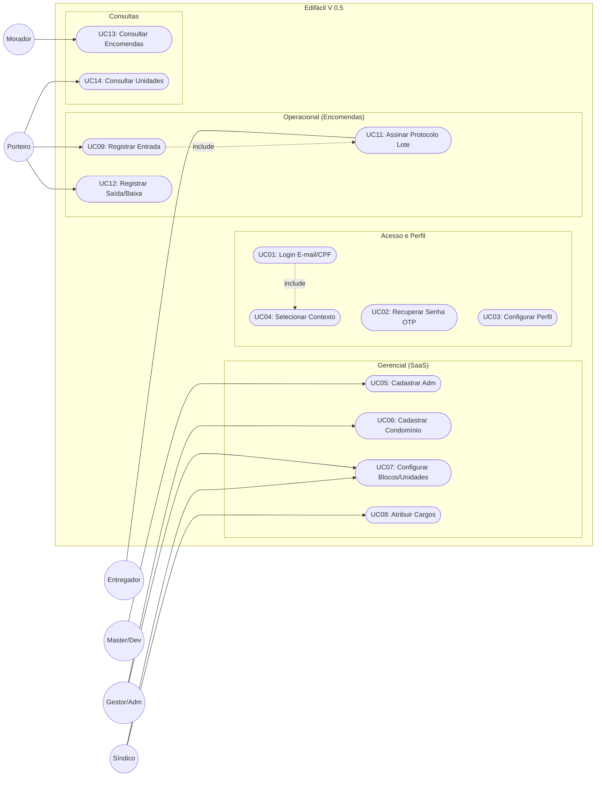

```mermaid
graph LR
    %% Definição de Estilos para Atores e Casos de Uso
    classDef actor fill:#f9f,stroke:#333,stroke-width:2px
    classDef usecase fill:#fff,stroke:#002045,stroke-width:2px,rx:20,ry:20

    %% Atores
    Master((Master/Dev))
    Adm((Gestor/Adm))
    Sindico((Síndico))
    Porteiro((Porteiro))
    Morador((Morador))
    Entregador((Entregador))

    %% Sistema / Fronteira
    subgraph "Edifácil V 0.5"
        
        subgraph "Acesso e Perfil"
            UC01([UC01: Login E-mail/CPF])
            UC02([UC02: Recuperar Senha OTP])
            UC03([UC03: Configurar Perfil])
            UC04([UC04: Selecionar Contexto])
        end

        subgraph "Gerencial (SaaS)"
            UC05([UC05: Cadastrar Adm])
            UC06([UC06: Cadastrar Condomínio])
            UC07([UC07: Configurar Blocos/Unidades])
            UC08([UC08: Atribuir Cargos])
        end

        subgraph "Operacional (Encomendas)"
            UC09([UC09: Registrar Entrada])
            UC10([UC11: Assinar Protocolo Lote])
            UC11([UC12: Registrar Saída/Baixa])
        end

        subgraph "Consultas"
            UC12([UC13: Consultar Encomendas])
            UC13([UC14: Consultar Unidades])
        end
    end

    %% Relacionamentos
    Master --> UC05
    Adm --> UC06
    Adm --> UC07
    Sindico --> UC07
    Sindico --> UC08
    Porteiro --> UC09
    Porteiro --> UC11
    Porteiro --> UC13
    Entregador --- UC10
    Morador --> UC12

    %% Inclusões (Includes)
    UC01 -.->|include| UC04
    UC09 -.->|include| UC10
```