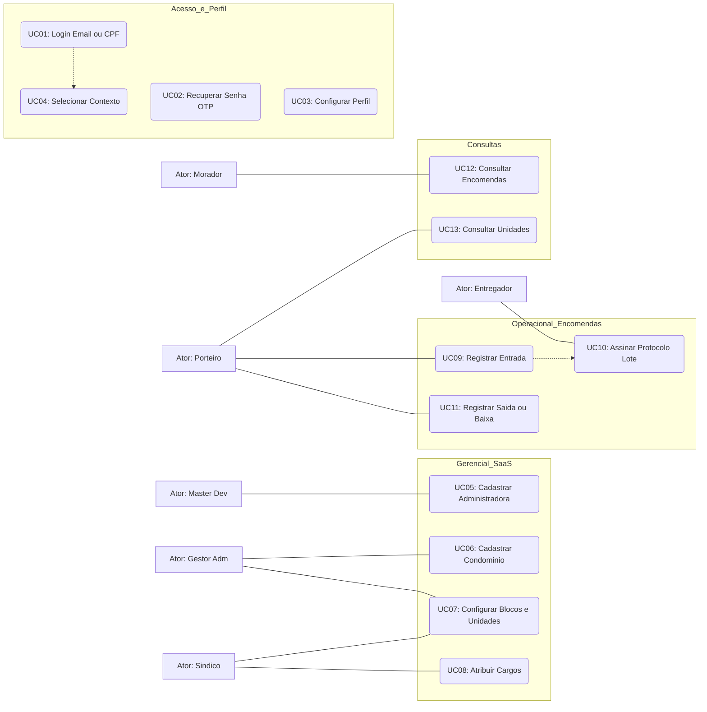

```mermaid
graph LR
    %% Atores (Retângulos Simples)
    Master[Ator: Master Dev]
    Adm[Ator: Gestor Adm]
    Sindico[Ator: Sindico]
    Porteiro[Ator: Porteiro]
    Morador[Ator: Morador]
    Entregador[Ator: Entregador]

    subgraph Acesso_e_Perfil
        UC01(UC01: Login Email ou CPF)
        UC02(UC02: Recuperar Senha OTP)
        UC03(UC03: Configurar Perfil)
        UC04(UC04: Selecionar Contexto)
    end

    subgraph Gerencial_SaaS
        UC05(UC05: Cadastrar Administradora)
        UC06(UC06: Cadastrar Condominio)
        UC07(UC07: Configurar Blocos e Unidades)
        UC08(UC08: Atribuir Cargos)
    end

    subgraph Operacional_Encomendas
        UC09(UC09: Registrar Entrada)
        UC10(UC10: Assinar Protocolo Lote)
        UC11(UC11: Registrar Saida ou Baixa)
    end

    subgraph Consultas
        UC12(UC12: Consultar Encomendas)
        UC13(UC13: Consultar Unidades)
    end

    %% Relacionamentos
    Master --- UC05
    Adm --- UC06
    Adm --- UC07
    Sindico --- UC07
    Sindico --- UC08
    Porteiro --- UC09
    Porteiro --- UC11
    Porteiro --- UC13
    Entregador --- UC10
    Morador --- UC12

    %% Dependencias
    UC01 -.-> UC04
    UC09 -.-> UC10
```
