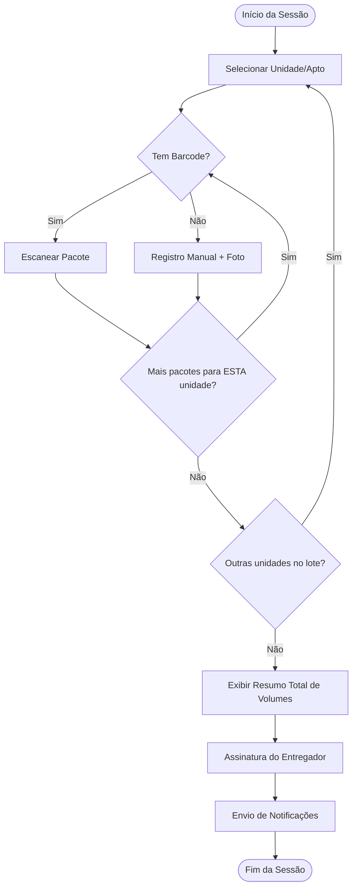

# Documentação de Escopo: Módulo de Encomendas (v5.0)
**Foco:** Agilidade na Portaria e Gestão por Unidade

---

## 1. Visão Geral do Fluxo
O processo de recebimento foi desenhado para ser "Unit-First" (Unidade Primeiro). Isso permite que o porteiro processe lotes de mercadorias já organizados fisicamente por apartamento, reduzindo o tempo de navegação no sistema.

## 2. Regras de Negócio e Logística

* **Agrupamento por Destino:** O porteiro seleciona a Unidade/Apartamento uma única vez e pode registrar múltiplos volumes em sequência para aquele mesmo destino.
* **Identificação Flexível:** Suporte nativo para leitura de códigos de barras/QR e registro manual com foto para itens sem etiqueta (correspondências simples).
* **Conferência Passiva:** Diferente das versões anteriores, o sistema não exige uma contagem inicial. A conferência é feita no final, onde o entregador visualiza o resumo de tudo o que foi processado e assina o "recibo digital".
* **Notificação Diferida:** Os moradores só recebem o alerta (Push/WhatsApp) após a assinatura do entregador, garantindo que o processo foi concluído com sucesso.

---

## 3. Fluxograma de Processo (Mermaid)

---

## 4. Casos de Uso Atendidos
1.  **Múltiplos pacotes para o mesmo morador:** Processados em um único loop de unidade.
2.  **Etiqueta Danificada:** Registro manual via foto mantendo a integridade do lote.
3.  **Entrega em Lote (Transportadoras):** Assinatura única para diversos apartamentos, gerando um protocolo de entrega consolidado.