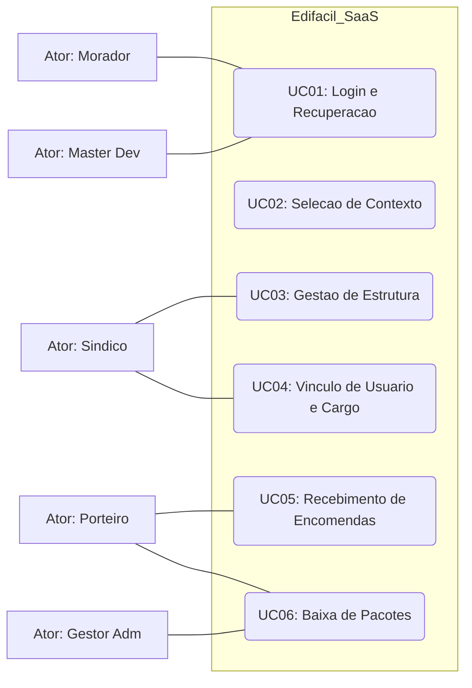
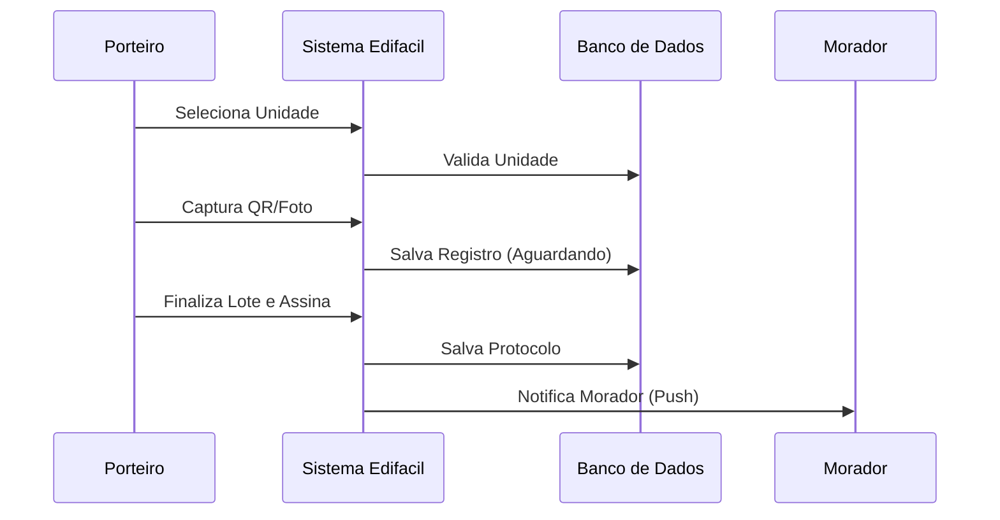

# Edifácil V 0.5 - Documentação Completa de Negócio e Design

## 1. Visão Geral
Sistema SaaS nacional focado em simplificar a gestão operacional de condomínios.
**Motto:** "Edifício é difícil? Edifácil resolve."

## 2. Design System
- **Cores:** Primary (#002045), Secondary (#515F74), Accent (#C5A059), Neutral (#334155).
- **Tipografia:** Sans Serif Corporativa.
- **Bordas:** 12px Arredondadas.

## 3. Diagrama de Casos de Uso (UML)

## 4. Diagrama de Sequência (Logística de Encomendas)

## 5. Fluxo de Navegação (Hierarquia Crescente)
1. **Login** -> 2. **OTP** -> 3. **Context Selector** -> 4. **Perfil** -> 5. **Admin/Vínculos** -> 6. **Dashboard Op** -> 7. **Recebimento** -> 8. **Assinatura Final**.

## 6. Prompts para Google Stitch (Nano Banana 2)
Utilizar a paleta #002045 e #C5A059. Criar telas com foco operacional, botões claros e tipografia legível. As telas operacionais (Scanner e Assinatura) devem ser as mais detalhadas, com guias visuais para o porteiro.

---
*Documento gerado para a Versão Piloto 0.5 (Março/2026)*