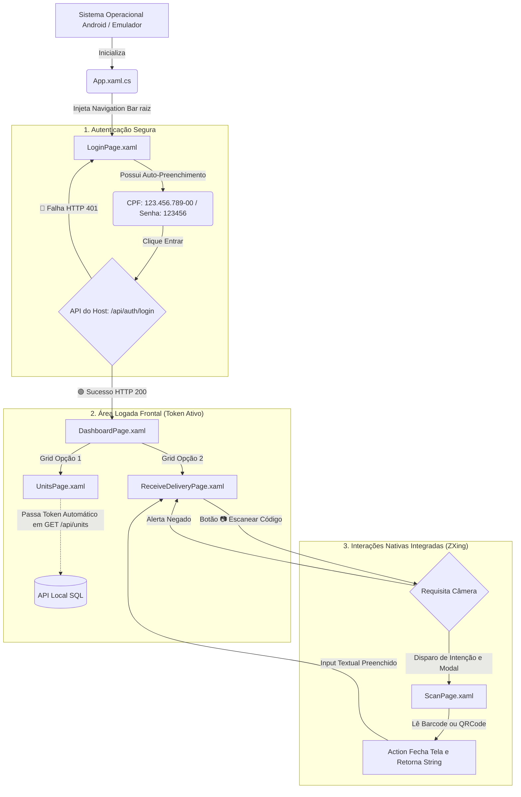

# Fluxograma de Telas (Condominium App)

O fluxo principal do aplicativo (voltado para o perfil Porteiro/Janitor) obedece à lógica linear abaixo descrita.

```mermaid
graph TD
    A[Sistema Operacional Android / Emulador] -->|Inicializa| B(App.xaml.cs)
    B -->|Injeta Navigation Bar raiz| C[LoginPage.xaml]
    
    subgraph "1. Autenticação Segura"
        C -->|Possui Auto-Preenchimento| D(CPF: 123.456.789-00 / Senha: 123456)
        D -->|Clique Entrar| E{API do Host: /api/auth/login}
        E -->|🔴 Falha HTTP 401| C
    end
    
    subgraph "2. Área Logada Frontal (Token Ativo)"
        E -->|🟢 Sucesso HTTP 200| F[DashboardPage.xaml]
        F -->|Grid Opção 1| G[UnitsPage.xaml]
        F -->|Grid Opção 2| H[ReceiveDeliveryPage.xaml]
        
        G -.->|Passa Token Automático em GET /api/units| I[(API Local SQL)]
    end
    
    subgraph "3. Interações Nativas Integradas (ZXing)"
        H -->|Botão 📷 Escanear Código| J{Requisita Câmera}
        J -->|Alerta Negado| H
        J -->|Disparo de Intenção e Modal| K[ScanPage.xaml]
        K -->|Lê Barcode ou QRCode| L[Action Fecha Tela e Retorna String]
        L -->|Input Textual Preenchido| H
    end
```
