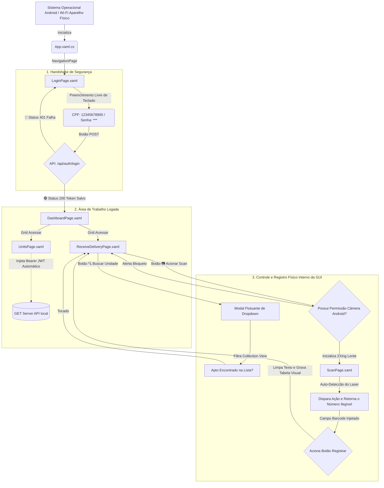

# Fluxograma de Telas (Condominium App)

Este diagrama Mermaid mapeia em alto espectro a jornada do Perfil **"Porteiro/Janitor"** efetuando Check-in de Pacotes via rotas HTTP no dispositivo.

```mermaid
graph TD
    A[Sistema Operacional Android / Wi-Fi Aparelho Físico] -->|Inicializa| B(App.xaml.cs)
    B -->|NavigationPage| C[LoginPage.xaml]
    
    subgraph "1. Handshake de Segurança"
        C -->|Preenchimento Livre de Teclado| D("CPF: 12345678900 / Senha: ***")
        D -->|Botão POST| E{API: /api/auth/login}
        E -->|🔴 Status 401 Falha| C
    end
    
    subgraph "2. Área de Trabalho Logada"
        E -->|🟢 Status 200 Token Salvo| F[DashboardPage.xaml]
        F -->|Grid Acessar| G[UnitsPage.xaml]
        F -->|Grid Acessar| H[ReceiveDeliveryPage.xaml]
        
        G -.->|Injeta Bearer JWT Automático| I[(GET Server API local)]
    end
    
    subgraph "3. Controle e Registro Físico Interno da GUI"
        H -->|Botão 🔍 Buscar Unidade| Pop[Modal Flutuante de Dropdown]
        Pop -->|Filtra Collection View| PopSelect[Apto Encontrado na Lista?]
        PopSelect -->|Tocado| H
        
        H -->|Botão 📷 Acionar Scan| J{Possui Permissão Câmera Android?}
        J -->|Alerta Bloqueio| H
        J -->|Inicializa ZXing Lente| K[ScanPage.xaml]
        K -->|Auto-Deteccão do Laser| L[Dispara Ação e Retorna o Número Ilegível]
        L -->|Campo Barcode Injetado| M{Aciona Botão Registrar}
        
        M -->|Limpa Texto e Grava Tabela Visual| H
    end
```
