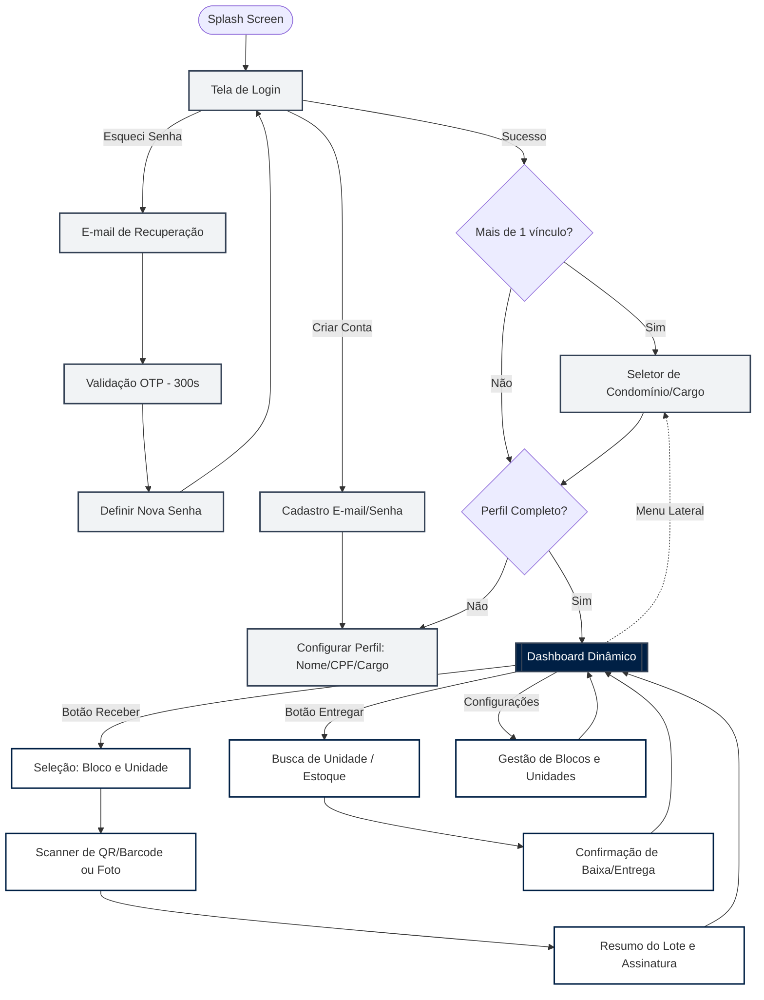

```mermaid
flowchart TD
    %% Estilo
    classDef auth fill:#f1f3f5,stroke:#334155,stroke-width:2px
    classDef dash fill:#002045,color:#fff,stroke:#334155,stroke-width:2px
    classDef op fill:#fff,stroke:#002045,stroke-width:2px

    Start([Splash Screen]) --> Login[Tela de Login]
    
    %% Fluxo de Acesso
    Login -- "Esqueci Senha" --> Forgot[E-mail de Recuperação]
    Forgot --> OTP[Validação OTP - 300s]
    OTP --> NewPass[Definir Nova Senha]
    NewPass --> Login

    Login -- "Criar Conta" --> Register[Cadastro E-mail/Senha]
    Register --> Profile[Configurar Perfil: Nome/CPF/Cargo]
    
    %% Direcionamento de Contexto
    Login -- "Sucesso" --> Context{Mais de 1 vínculo?}
    Context -- "Sim" --> Selector[Seletor de Condomínio/Cargo]
    Context -- "Não" --> ProfileCheck{Perfil Completo?}
    
    Selector --> ProfileCheck
    ProfileCheck -- "Não" --> Profile
    ProfileCheck -- "Sim" --> Dash[[Dashboard Dinâmico]]

    %% Navegação do Dashboard (Portaria)
    Dash -- "Botão Receber" --> Recv1[Seleção: Bloco e Unidade]
    Recv1 --> Recv2[Scanner de QR/Barcode ou Foto]
    Recv2 --> Recv3[Resumo do Lote e Assinatura]
    Recv3 --> Dash

    Dash -- "Botão Entregar" --> Deliv1[Busca de Unidade / Estoque]
    Deliv1 --> Deliv2[Confirmação de Baixa/Entrega]
    Deliv2 --> Dash

    %% Navegação do Dashboard (Síndico/Adm)
    Dash -- "Configurações" --> Struct[Gestão de Blocos e Unidades]
    Struct --> Dash

    %% Troca de Contexto
    Dash -.->|Menu Lateral| Selector

    class Login,Forgot,OTP,NewPass,Register,Profile,Selector auth
    class Dash dash
    class Recv1,Recv2,Recv3,Deliv1,Deliv2,Struct op
```