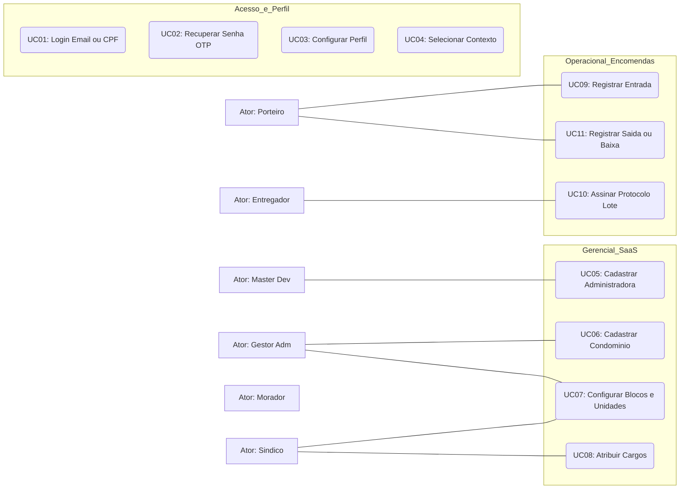

# Edifácil V 0.5 - Documento de Visão Geral e Escopo

---

## 1. Contexto do Projeto
O **Edifácil** é uma plataforma SaaS projetada para simplificar a operação diária de condomínios. A versão inicial (0.5) foca na resolução do gargalo de recebimento de encomendas em portarias de prédios residenciais.

## 2. Hierarquia Operacional
Para garantir escalabilidade nacional, a estrutura de dados respeita a seguinte árvore:
- **Master** -> Administradoras -> Condomínios -> Blocos -> Unidades.

## 3. Regras de Negócio Críticas
- **Segurança:** Senha mínima de 8 caracteres (1 especial, 1 número, 1 maiúscula/minúscula).
- **Validação:** Código OTP por e-mail com validade de 300 segundos.
- **Multivínculo:** Um único CPF pode possuir múltiplos cargos em diferentes condomínios.
- **Logística:** Fluxo "Unidade-First" para agilizar o registro de múltiplos pacotes.

## 4. Mapa de Telas (V 0.5)
### Módulo de Acesso
- Login (CPF/E-mail)
- Cadastro Inicial
- Esqueci Senha (OTP 300s)
- Seletor de Contexto (Condomínio/Cargo)
- Perfil do Usuário (Nome, CPF, Telefone, Foto, Cargo)

### Módulo Gerencial
- Dashboard Admin (Administradora)
- Cadastro de Condomínios
- Configuração de Estrutura (Blocos e Unidades)
- Atribuição de Usuários a Unidades/Cargos

### Módulo Operacional (Portaria)
- Dashboard de Operações
- Recepção de Encomendas (v5 - Agrupado por Unidade)
- Registro de Evidência (Scanner/Foto)
- Resumo e Assinatura de Lote
- Baixa de Encomendas (Saída)

## 5. Casos de Uso (UML Mermaid)

---

*Documento gerado para a versão piloto (54 apartamentos).*